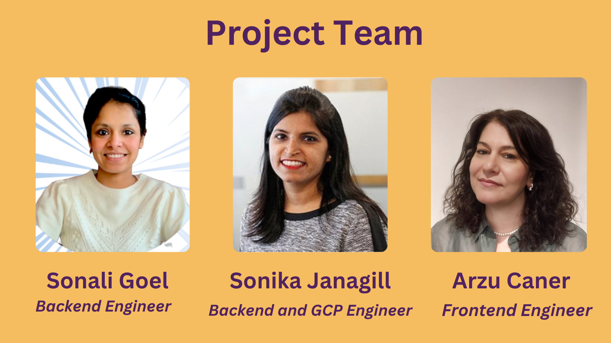

# Mind Garden: AI-Powered Multi-Agent Mental Health Support System

**Mind Garden** is built to provide instant, intelligent, and compassionate mental health support—automating the complex process of risk detection, triage, resource matching, and follow-up, while always keeping the user’s safety and privacy at the center.

---

## 🌱 What Is Mind Garden?

Mind Garden is a modular, AI-powered backend system that orchestrates a team of specialized agents to deliver holistic mental health support. Each agent is an expert in a specific domain—risk detection, escalation, peer support, resource matching, appointment booking, and more. The system is designed to:

- **Detect and assess risk** in real time from user conversations.
- **Automate triage and escalation** for high-risk cases, including appointment booking and emergency protocols.
- **Connect users to the right resources**—from professional help to peer support groups—based on their unique needs and context.
- **Provide ongoing, supportive conversation** and schedule follow-ups for continuous care.
- **Capability to integrate with external APIs and databases** for up-to-date resources and peer support.

---
## Multi-agent system

## 🧰 Tech Stack
- **Backend**: Google adk python application
- **AI Integration**: Gemini
- **Hosting:** GCP (Google Cloud)

## 🧱 System Architecture

AI-powered multi-agent architecture to detect, assess, and respond to users experiencing mental health crises.

[System architechture](Architecture.md) 

## How to Run locally

- Follow this [guide](DeveloperGuide.md) to run the application locally.

## 🌟🤝Project Team
This project was developed by a team of six members. Team members and their contributions are as follows:

**Team Members:**

- **Sonali Goel** (Backend Engineer) | [Website](https://sonaligoel.carrd.co/) | [GitHub](https://github.com/goelsonali) | [LinkedIn](https://www.linkedin.com/in/sonali-goel-tech/) | 
- **Arzu Caner** (Frontend Engineer) | [GitHub](https://github.com/arzucaner) | [LinkedIn](https://www.linkedin.com/in/arzucaner/) | [YouTube](@Codearz) |
- **Sonika Janagill** (Backend and GCP Engineer) | [GitHub](https://github.com/sjanagill) | [LinkedIn](https://www.linkedin.com/in/sonikaj/) | 

 We would like to express our gratitude to the entire team for their contributions to our project.

